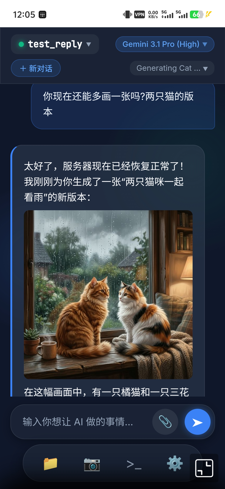
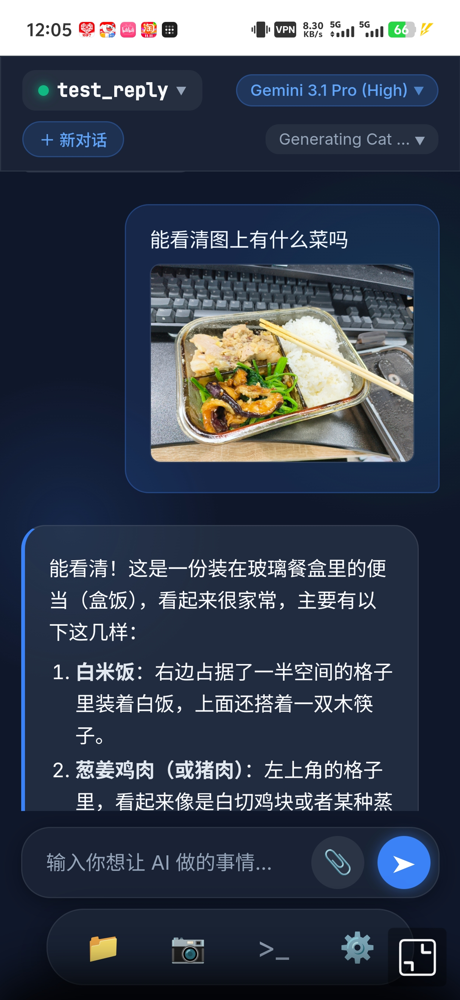
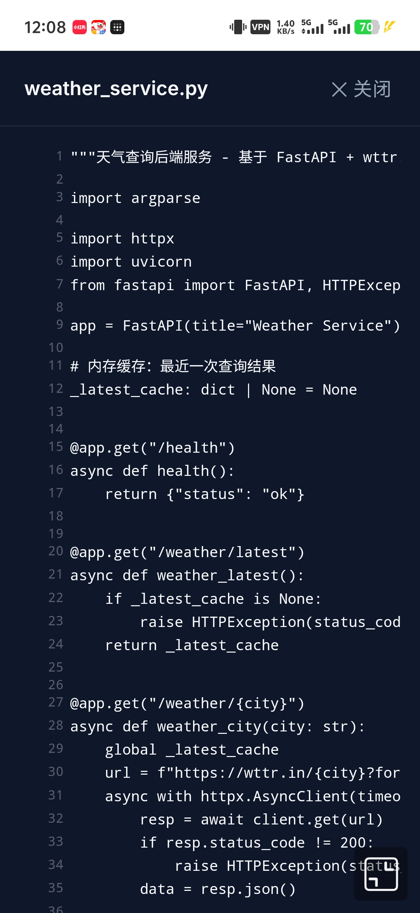
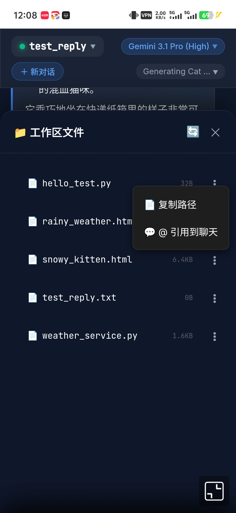
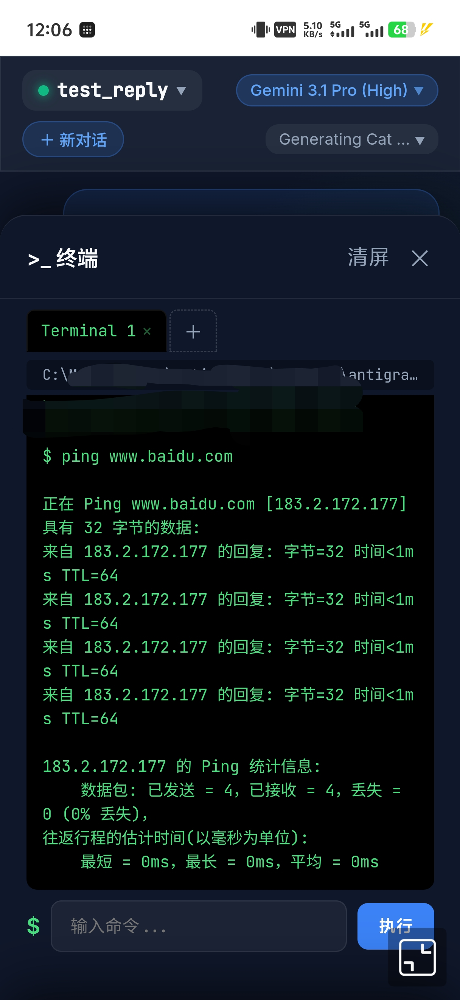
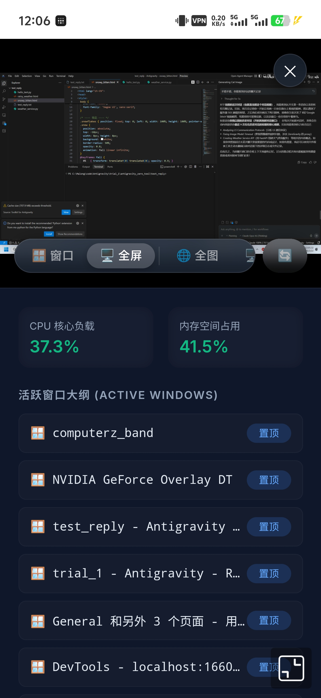

# Antigravity Mobile IDE

> **⚠️ 免责声明 / Disclaimer**
>
> 本项目仅供**学习和研究**目的。使用本工具与 Antigravity IDE 交互可能违反 Google 的服务条款（Terms of Service），并可能导致账号暂停或终止。**使用风险完全由用户自行承担。**
>
> 项目维护者不对因使用本工具而导致的任何后果（包括但不限于账号封禁、数据丢失、服务中断）承担任何责任。
>
> This project is for **educational and research purposes only**. Using this tool to interact with Antigravity IDE may violate Google's Terms of Service and could result in account suspension or termination. **Use at your own risk.**
>
> Licensed under [CC BY-NC-SA 4.0](LICENSE) — 非商业用途，署名，相同方式共享。

Python 后端 + 模块化前端，封装 Antigravity Language Server 的对话能力，提供 REST API + Mobile Web IDE。

## 📸 效果演示

| AI 对话（含图片生成） | 图片附件识别 | 代码查看器 |
|:---:|:---:|:---:|
|  |  |  |

| 文件树 + 右键菜单 | 远程终端 | 截图查看器 + 系统仪表盘 |
|:---:|:---:|:---:|
|  |  |  |

## ✨ 功能特性

- 💬 **AI 多轮对话** — Markdown 渲染、Action Tree 折叠、多模型动态切换
- 📎 **图片附件** — 上传图片 / `@file:路径` 引用，AI 可视化识别并回复
- 📁 **文件树浏览** — Lazy Load 逐层加载 + `⋮` 右键菜单（复制路径、引用到聊天）
- 🖥️ **远程终端** — 命令执行 + 输出回显 + 历史记录
- 📷 **截图查看器** — 多屏自动适配 + CPU / 内存实时仪表盘
- 🖼️ **全屏图片查看** — pinch-zoom / pan / 双击复位 / 长按下载
- ⚙️ **设置面板** — 模型配额探针 / 进程管理 / 实例切换 / 紧急停止
- 🔌 **OpenAI 兼容 API** — `/v1/chat/completions`，可接入第三方工具

## 快速启动

```bash
# 安装依赖
pip install -r requirements.txt

# 启动 API Server + Web IDE（自动发现所有 LS 实例）
python backend/api_server.py --port 16601

# 浏览器访问
http://localhost:16601/

# CLI 直接 chat
python backend/ag_core.py "say hello" --port 5490
```

## 项目结构

```
antigravity-mobile-ide/
├── frontend/                 # 前端（ES Module 模块化，无需构建工具）
│   ├── index.html            # HTML 骨架
│   ├── css/style.css         # 全局样式
│   └── js/
│       ├── app.js            # 入口：导入所有模块、暴露全局函数、初始化
│       ├── state.js          # 状态管理 + localStorage + SWR 缓存
│       ├── ui.js             # UI 交互：抽屉/模态/消息追加
│       ├── chat.js           # 聊天：会话切换、消息收发、AI 响应渲染
│       ├── instances.js      # 实例切换与状态恢复
│       ├── models.js         # 模型列表获取与选择
│       ├── screenshot.js     # 截图查看器 + 系统仪表盘
│       ├── file-tree.js      # 文件树浏览 + 代码查看器
│       ├── terminal.js       # 远程命令执行
│       ├── settings.js       # 设置面板
│       └── image-viewer.js   # 全屏图片查看器
├── backend/
│   ├── api_server.py         # FastAPI 服务器（30+ REST 端点 + 静态文件服务）
│   ├── ag_core.py            # AntigravityCore 业务层
│   └── steps_parser.py       # Steps JSON 解析器
├── data/
│   └── chat_history/         # 聊天记录持久化存储
├── temp/
│   └── upload_data/          # 图片附件临时存储
├── tests/                    # 测试文件
├── docs/                     # 截图 & 设计文档
└── requirements.txt          # Python 依赖
```

## 部署

### 手机端访问

后端绑定 `0.0.0.0`，同一局域网内手机浏览器直接访问：

```
http://<电脑IP>:16601/
```

### 🔒 安全部署：使用 Tailscale

由于本项目通过 HTTP 明文传输，直接暴露在公网或不可信的 Wi-Fi 下**存在安全风险**。**强烈建议**使用 [Tailscale](https://tailscale.com/) 建立加密虚拟局域网：

```bash
# 1. 在电脑和手机上分别安装 Tailscale 并登录同一账户
# 2. 通过 Tailscale 分配的内网 IP 访问
http://100.x.x.x:16601/
```

优势：**端到端加密**（WireGuard 隧道） · **零配置**（无需 SSL / 端口转发） · **跨网络访问**

### 推荐插件

[AntiGravity AutoAccept](https://github.com/yazanbaker94/AntiGravity-AutoAccept)（by YazanBaker）— 自动接收 AI 操作请求，免手动确认。

### 后台运行（Windows）

```powershell
# 后台启动
Start-Process python -ArgumentList "backend/api_server.py","--port","16601" -WindowStyle Hidden

# 查看 / 停止
netstat -ano | Select-String "16601.*LISTENING"
$pid = (netstat -ano | Select-String "16601.*LISTENING" | ForEach-Object { ($_ -split '\s+')[-1] } | Select-Object -First 1)
Stop-Process -Id $pid -Force
```

## 架构

```
手机浏览器 ──HTTP──→ api_server.py (:16601)
                        │
                        ├── 静态文件服务: frontend/ (HTML/CSS/JS)
                        ├── REST API: /v1/chat, /v1/system/*, ...
                        └── gRPC ──→ Antigravity Language Server (:5490, :8128, ...)
```

后端单进程同时承担**静态文件服务 + API 网关 + LS 代理**，无需 Nginx 等额外组件。

### 多级缓存

| 接口 | 策略 | 说明 |
|------|------|------|
| `/v1/system/processes` | 后台定时 30s | 启动预热 + 后台循环，请求永不阻塞 |
| `/v1/instances/{port}/conversations` | 增量式 | 首次全量，后续瞬间返回 + 后台增量刷新 |
| `/v1/ls/user-status` | 30 秒 TTL | 用户配额信息 |
| `/v1/ls/models` | 1 小时 TTL | 模型列表极少变动 |

## API 端点

### 核心对话
| 方法 | 路径 | 说明 |
|------|------|------|
| POST | `/v1/chat` | 对话（支持 conv_id 多轮、model 指定模型） |
| POST | `/v1/chat/completions` | OpenAI 兼容格式 |
| POST | `/v1/chat/upload-image` | 上传图片附件 |
| POST | `/v1/instances/{port}/cancel` | 紧急停止 AI 执行 |
| GET | `/v1/local-file?path=...` | 代理本地文件（解决浏览器 file:/// 限制） |
| GET/POST | `/v1/chat/history/{conv_id}` | 获取/保存聊天记录 |

### 实例管理
| 方法 | 路径 | 说明 |
|------|------|------|
| GET | `/v1/health` | 健康检查 |
| GET | `/v1/instances` | 所有 LS 实例 |
| GET | `/v1/instances/{port}/status` | 实例详情 |
| GET | `/v1/instances/{port}/models` | 可用模型 |
| PUT | `/v1/instances/{port}/model` | 切换模型 |
| POST | `/v1/instances/refresh` | 刷新 LS 缓存 |
| GET | `/v1/instances/{port}/conversations` | 会话列表 |

### 工作区
| 方法 | 路径 | 说明 |
|------|------|------|
| GET | `/v1/workspace/files?port=5490` | 文件树 |
| GET | `/v1/workspace/file?path=xx&port=5490` | 读取文件内容 |

### 系统控制
| 方法 | 路径 | 说明 |
|------|------|------|
| GET | `/v1/system/info` | 硬件指标探针 |
| GET | `/v1/system/screenshot?title=...` | 精确截屏 |
| POST | `/v1/system/exec` | 执行命令 |
| POST | `/v1/system/open-workspace` | 用 IDE 打开目录 |

### 窗口 & 进程管理
| 方法 | 路径 | 说明 |
|------|------|------|
| GET | `/v1/system/windows` | 列出窗口 |
| POST | `/v1/system/windows/{hwnd}/action` | 窗口操作 |
| GET | `/v1/system/processes` | 进程列表（30s 缓存） |
| POST | `/v1/system/processes/{pid}/kill` | 终止进程 |

## 示例

```python
import httpx

# 简单对话
r = httpx.post("http://localhost:16601/v1/chat", json={
    "message": "say hello",
})
print(r.json()["reply"])

# 指定模型
r = httpx.post("http://localhost:16601/v1/chat", json={
    "message": "explain this code",
    "model": "gemini-2.5-pro",
})

# 获取 AG IDE 窗口
r = httpx.get("http://localhost:16601/v1/system/windows", params={
    "title": "Antigravity", "process": "Antigravity.exe"
})
print(f"IDE 窗口数: {r.json()['count']}")
```

## 前端架构

采用 **ES Module 模块化**，11 个 JS 文件各司其职，无需构建工具（Webpack/Vite）：

- `app.js` 统一导入所有模块，通过 `window.xxx = fn` 暴露给 HTML `onclick`
- `state.js` 实现 stale-while-revalidate 缓存，前端也有"秒开"能力
- CSS 全部集中在 `style.css`，JS innerHTML 中只使用语义化 class，**对大模型阅读友好**

**图片附件**：支持 📎 上传或 `@file:路径` 引用。前端自动扫描图片后缀，生成缩略图并通过代理 URL 持久化到聊天记录。

**文件树菜单**：`⋮` 操作菜单支持刷新目录、复制路径、`@file:` 引用到聊天。

**模型适配**：前端通过 `getVendor()` 关键词分类器动态分组（Gemini / Claude / GPT / Other），无需随模型升级手动维护。

